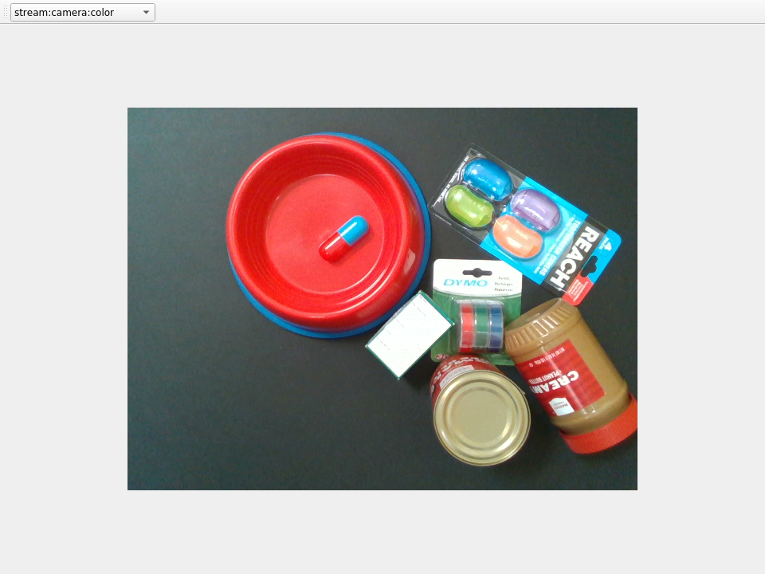

## stream-viewer

### Overview
The stream-viewer element is a GUI tool used for viewing image data that is written to a stream. 
It works with the realsense element's color and depth streams and is a useful tool for testing and debugging computer vision algorithms. 



### docker-compose configuration
This element requires special flags to enable display forwarding.

```
  stream-viewer:
    build:
      context: .
      dockerfile: Dockerfile
    volumes:
      - type: volume
        source: shared
        target: /shared
        volume:
          nocopy: true
      - "/tmp/.X11-unix:/tmp/.X11-unix:rw"
    environment:
      - "DISPLAY"
      - "QT_X11_NO_MITSHM=1"  
    depends_on:
      - "nucleus"
```


### Usage
Since this element utilizes a GUI, we need to forward the display between Docker and the host machine.
This command will allow the root user in the container to have access to the X Server. Run this command on the host machine.

```
xhost +SI:localuser:root
```

Then start the element following the usual steps.


### Usage with realsense element
Start this element in conjunction with the realsense element.


### Usage with your own image streams
Currently, stream-viewer will list all available streams in the atom system, but can only view streams with data of a specific format. Specifically, this element expects a tif encoded image written to a stream with the key to the image as `data`
This can be done in Python as follows

```
_, tif_img = cv2.imencode(".tif", img)
element.entry_write("img", {"data": tif_img.tobytes()}, maxlen=30)
```

Where `img` is an OpenCV image.
